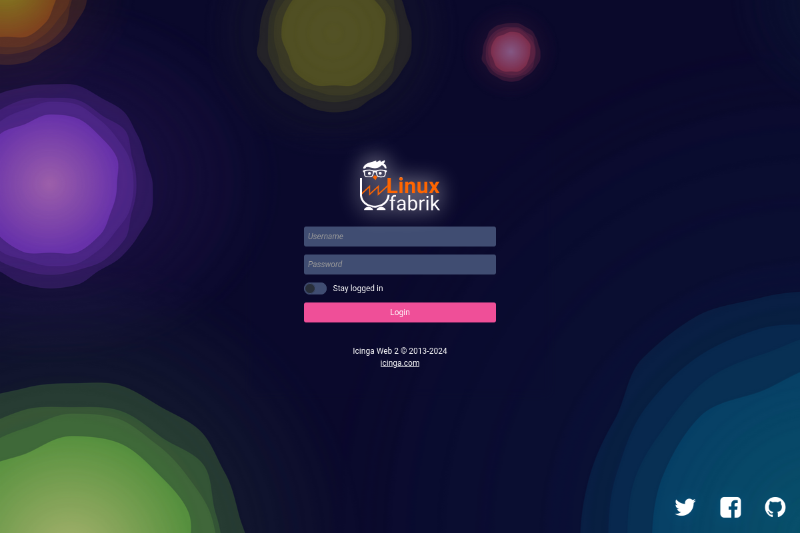

<h1 align="center">
  <a href="https://linuxfabrik.ch" target="_blank">Linuxfabrik</a> Icinga Web 2 Theme
</h1>
<p align="center">
  Linuxfabrik branding for Icinga Web 2: logo, login page and check icons sized to the state balls, in light and dark mode.
  <span>&#8226;</span>
  <b>made by <a href="https://linuxfabrik.ch/">Linuxfabrik</a></b>
</p>
<div align="center" markdown>


[](https://scorecard.dev/viewer/?uri=github.com/Linuxfabrik/icingaweb2-theme-linuxfabrik)
[](https://github.com/sponsors/Linuxfabrik)
[](https://www.paypal.com/cgi-bin/webscr?cmd=_s-xclick&hosted_button_id=7AW3VVX62TR4A&source=url)

</div>

<br />


# Linuxfabrik Icinga Web 2 Theme




## Installation

```bash
MODULE_NAME="linuxfabrik"
MODULE_VERSION="v1.1.2"
MODULE_AUTHOR="Linuxfabrik"
MODULES_PATH="/usr/share/icingaweb2/modules"
MODULE_PATH="${MODULES_PATH}/${MODULE_NAME}"
RELEASES="https://github.com/${MODULE_AUTHOR}/icingaweb2-theme-${MODULE_NAME}/archive"
mkdir "$MODULE_PATH" \
&& wget --quiet --output-document=- "$RELEASES/${MODULE_VERSION}.tar.gz" \
   | tar --extract --gzip --file=- --directory="$MODULE_PATH" --strip-components=1
icingacli module enable "${MODULE_NAME}"
```

For details, have a look at https://icinga.com/docs/icinga-web/latest/doc/08-Modules/.


## Usage

Each user selects the theme in the "Theme" field under "My Account". To make it the default for all users, set it in `/etc/icingaweb2/config.ini`:

```ini
[themes]
default = "linuxfabrik/linuxfabrik"
```


## Reporting Issues

1. [Submit an issue](https://github.com/Linuxfabrik/icingaweb2-theme-linuxfabrik/issues/new/choose) (preferred).
2. [Contact us](https://www.linuxfabrik.ch/en/contact) by email or web form and describe your problem.

For vulnerabilities, follow the private disclosure process in [SECURITY.md](SECURITY.md).


## Contributing

See [CONTRIBUTING.md](CONTRIBUTING.md) for guidelines.


## Support the Project

Enterprise support, including an SLA, is available via a [Service Contract](https://www.linuxfabrik.ch/en/products/service-support).

If this project helps you, consider a donation via
[GitHub Sponsors](https://github.com/sponsors/Linuxfabrik) or
[PayPal](https://www.paypal.com/cgi-bin/webscr?cmd=_s-xclick&hosted_button_id=7AW3VVX62TR4A&source=url).

There is no fixed roadmap. Milestones are driven by customer needs and by contributors' time.
